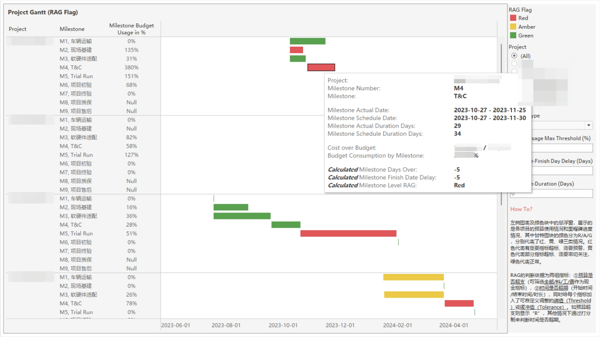
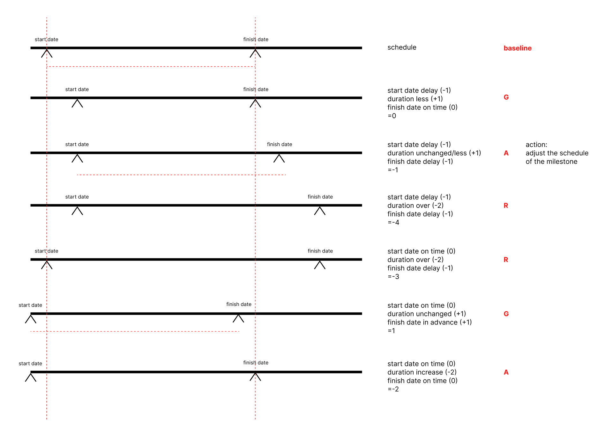

## Overview

In the ever-evolving landscape of business, the significance of effective project management cannot be overstated. Projects serve as the building blocks of progress, enabling companies to innovate, adapt, and thrive in dynamic markets. However, as projects grow in complexity and diversity, so do the challenges associated with managing them efficiently.

I recently received an analysis request from Project Management Office to monitor operational projects and extract insights that could inform decision-making and optimize project outcomes. I delved into project management methodologies and given the tasks and data at hand, tools like (B)RAG Status and Budget Availability Control (AVC) Checks give me a framework to start at. 

In this blog, we'll explore how RAG Flags provide visual cues within Gantt charts, allowing project teams to quickly assess the status of tasks and milestones. Additionally, we'll delve into the importance of AVC Checks in maintaining budgetary discipline, ensuring that financial resources are allocated optimally to support project objectives.

## RAG in project management

As [Elizabeth Harrin](https://rebelsguidetopm.com/understanding-rag-in-project-management/) clearly stated in *rgpm blog*, RAG stands for Red, Amber, Green. Each of the colors represent a type or series of management actions required. It's a shorthand summary for showing projects going well or those in trouble. 

| Flag | Color | Project                                                      |
| ---- | ----- | ------------------------------------------------------------ |
| B    | Blue  | Project closed                                               |
| R    | Red   | Project is likely to deliver late/over budget                |
| A    | Amber | Project has missed some targets but overall end date/budget is not at risk |
| G    | Green | Project on track                                             |

Different companies use different ways to visually cue the statuses. For example, some drop the blue, some use RYG (Red, Yellow, Green), some even use graphical indicators or emojis instead of colors to interpret. PMO should define exactly what each color means, provide the standards and then the analysts and project managers can then check project performance against those measures. 

### How to define RAG

Technically, a **Red** project means it's challenging and needs management attention. It could be over budget, behind schedule, or having issues that needs imminent support. For example,

- The project have issues that the project manager is not able to deal with the issues. Senior management is needed.
- Project scope or client requests will result in a level of risks, significant extra work, or extra cost that the budget hardly covers. 
- Resources lack, which impacts the schedule to deliver the quality promised. 

An **Amber** project means 

## How to set up RAG Flags in project reporting dashboard?

My client PMO currently lacks the project standards to identify each status. The data I have at hand is milestones of each project, the actual & predicted start date and finish date of each milestone, each milestone's budget and current actuals categorized into cost of goods, expenses, and labor costs. 

So what I did first is to set up a series of KPIs to help me categorize projects into 3 colors. 

### Money related variables

Budget consumption is above all other key indicators. As long as the actuals are over the budget, it's flagged as **Red**.

- Budget consumption = Actuals / Budget *100%, in each category of budget.

| Project standards                        | Flag |
| ---------------------------------------- | ---- |
| Either one of the actuals is over budget | R    |

### Time related variables 

I set up a point grading system to measure time punctuality as below, and tolerance for each KPI.

- Start date on time = (Actual start date <= Schedule start date), 
- Finish date on time = (Actual finish date - Schedule finish date <= Tolerance) 
- Duration within schedule = (Actual duration - Schedule duration <= Tolerance)

| Project standards              | Points |
| ------------------------------ | ------ |
| Finish date delayed            | -1     |
| Finish date advance            | +1     |
| Finish date on time            | 0      |
| Start date delayed             | -1     |
| Start date on time or advance  | 0      |
| Duration increase              | -2     |
| Duration unchanged or decrease | +1     |

After calculating the points according to these standards, we can have a total point for each milestone. 

| Total Points | RAG  |
| ------------ | ---- |
| [0, 2]       | G    |
| [-2, 0)      | A    |
| [-4, -2)     | R    |

## What's Budget AVC Check?

Before understanding budget AVC, we have to talk about budget consumption. According to SAP Learning, in public sector organizations, no business activity which leads to a future payment can be posted/approved without an available budget. As soon as governments foresee future payments as a result of an operative commitment document, they need to reserve their budget. This reservation of the budget needs to be documented through a financial budget consumption document, which is controlled by **active availability checking**. And this mechanism is referred to in this document as **commitment updating**.

In certain cases, including my current project, a commitment document is not available, so the actual document is directly consuming the budget. In both cases (with and without a reference to a predecessor commitment document) this is referred to as **actual updating**. Commitment and actual postings together form the **budget consumption**.

To simplify the analysis given the data at hand, I preprocess the data into categories below:

- Plan Category
  - Budget
  - Actual
- Budget Consumption Type
  - Expense
  - Costs of goods
  - Labor costs
- Budget Consumption Milestone
- Cost Center (a.k.a., project number/name)
- Amount

## Summary

## Reference

- SAP, [Understanding Availability Control](https://learning.sap.com/learning-journeys/implementing-budget-management-process-in-sap-s-4hana-cloud-public-edition-for-public-sector/understanding-availability-control_a6a28596-d0ed-40cd-801c-d034b8a90b6b) 
- Elizabeth Harrin, [rgpm](https://rebelsguidetopm.com/understanding-rag-in-project-management/) 
