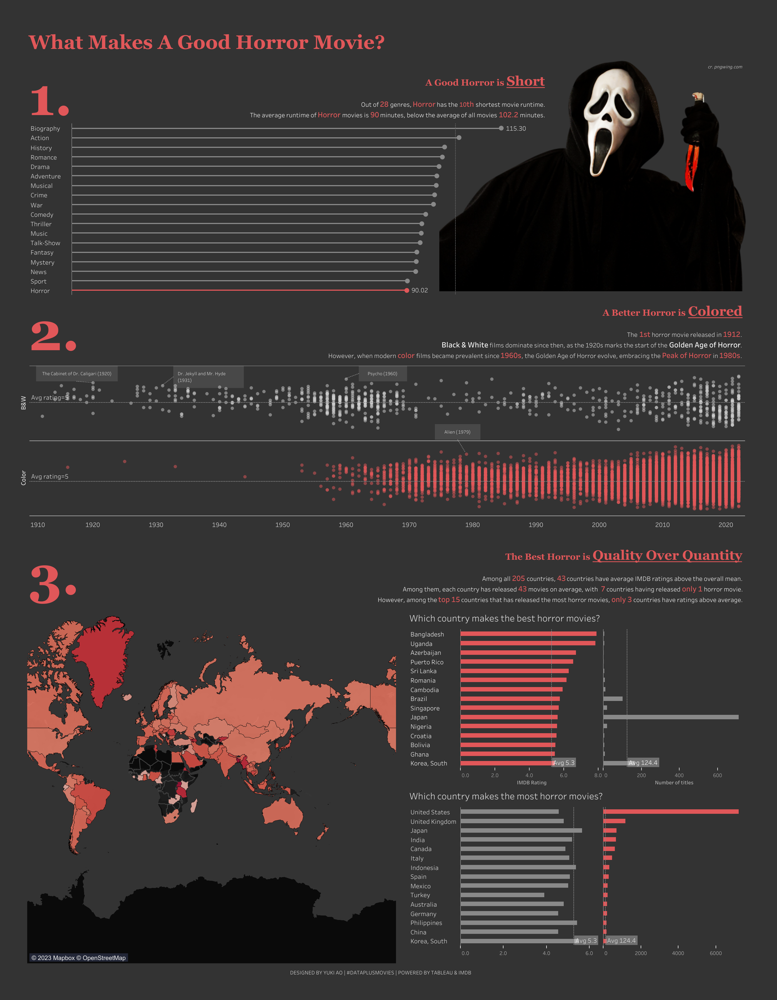

## Dashboard

🎉 Exciting News Alert! 🎉

I'm absolutely thrilled to share a milestone that has filled me with immense gratitude and joy. My visualization **[What Makes a Good Horror Movie?](https://public.tableau.com/app/profile/yukiao/viz/WhatMakesAGoodHorrorMovies/Whatmakesagoodhorrormovie)** was recently featured in [The Tableau Public Viz Gallery](https://www.tableau.com/blog/tableau-public-viz-gallery-tableau-conference-2024) at Tableau Conference 2024! 🚀

Being recognized together with so many talents on such a prestigious platform is truly a dream come true for me. It's a testament to the dedication and DataViz passion poured into my craft. I'm incredibly grateful for this opportunity to showcase my skills and creativity on a global stage.

I want to extend my heartfelt thanks to the Tableau community for the continuous support, inspiration, and encouragement. I'm beyond excited for what the future holds and can't wait to continue exploring new possibilities and pushing the boundaries of data visualization. Thank you, Tableau, for this incredible honor! 🙏

**Check out [Tableau Public](https://public.tableau.com/app/profile/yukiao/viz/WhatMakesAGoodHorrorMovies/Whatmakesagoodhorrormovie) for my dashboard, and [Tableau Blog](https://www.tableau.com/blog/tableau-public-viz-gallery-tableau-conference-2024) for other amazing visualizations! If you are in San Diego for TC 2024, be sure to stop by the Data + Movies booth to see my viz!** 

## Project background

Tableau partners with IMDB and presents the "Data Plus Movies" challenge. The dataset provided by IMDB contains movies from 1900 to 2022. Challenge link is [here](https://www.tableau.com/community/movies). You're still welcome to play with it.

So last November, Halloween has just passed the corner, yet the allure of horror movies remains still.  I watched a lot of horror films and came to wonder that what the defining points are that make a good horror movie? I’ve explored a bit from #DataPlusMovies data and did a quick research on horror movies over the years. 

## Challenges

It’s a quick design that only took me one day, so it’s not really statistically proven. It’s my first public project that I get to play a bit with. And I’m happy with the t-shirt I get afterwards from Tableau. 
