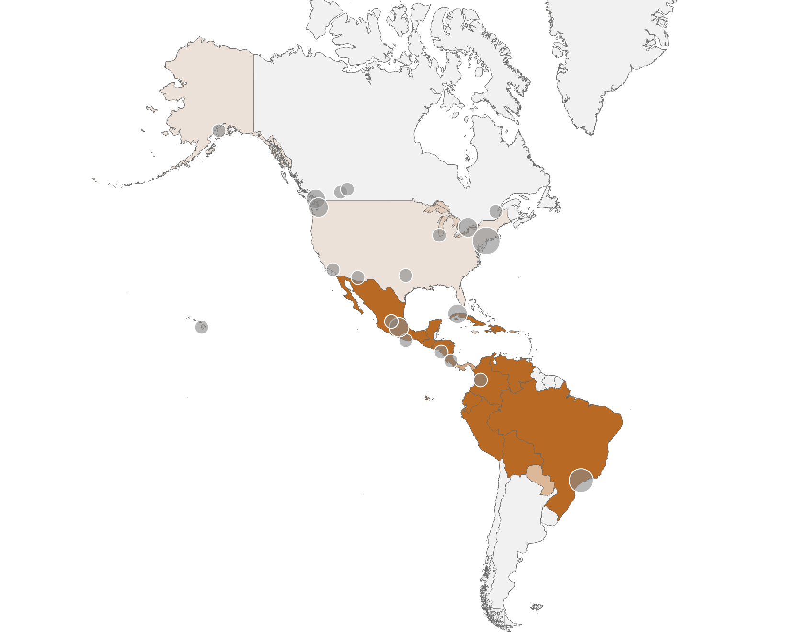
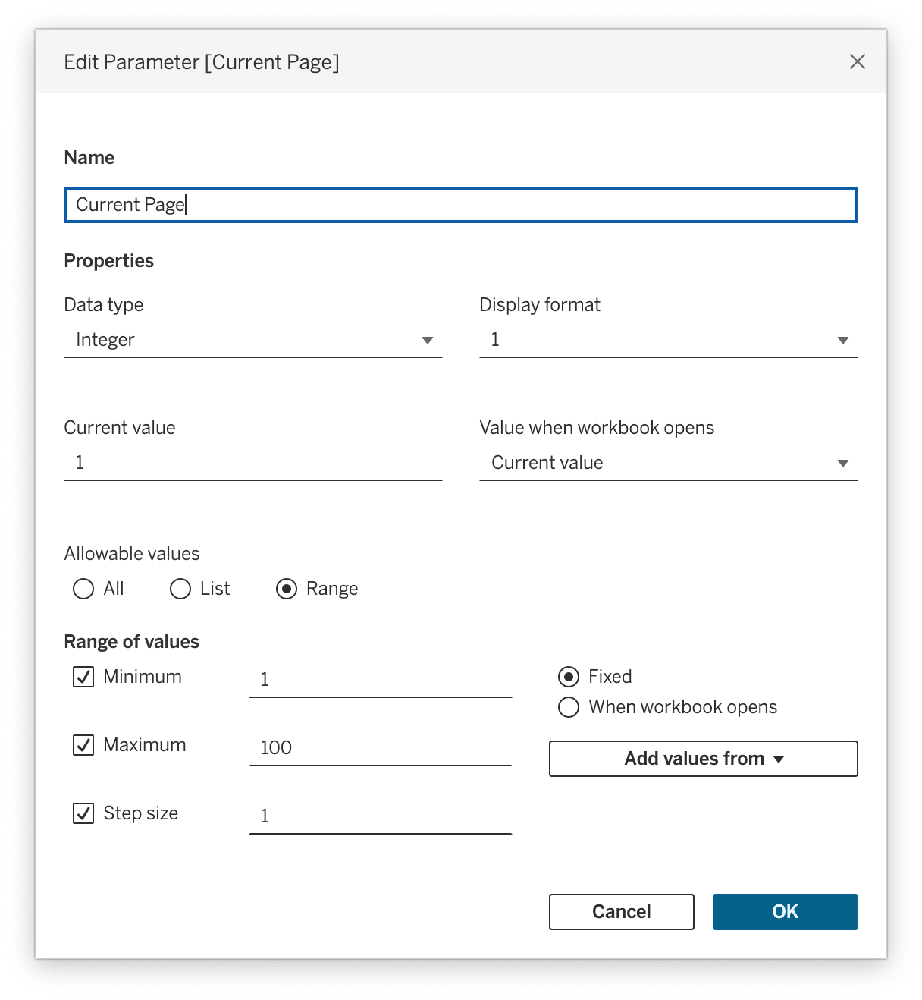
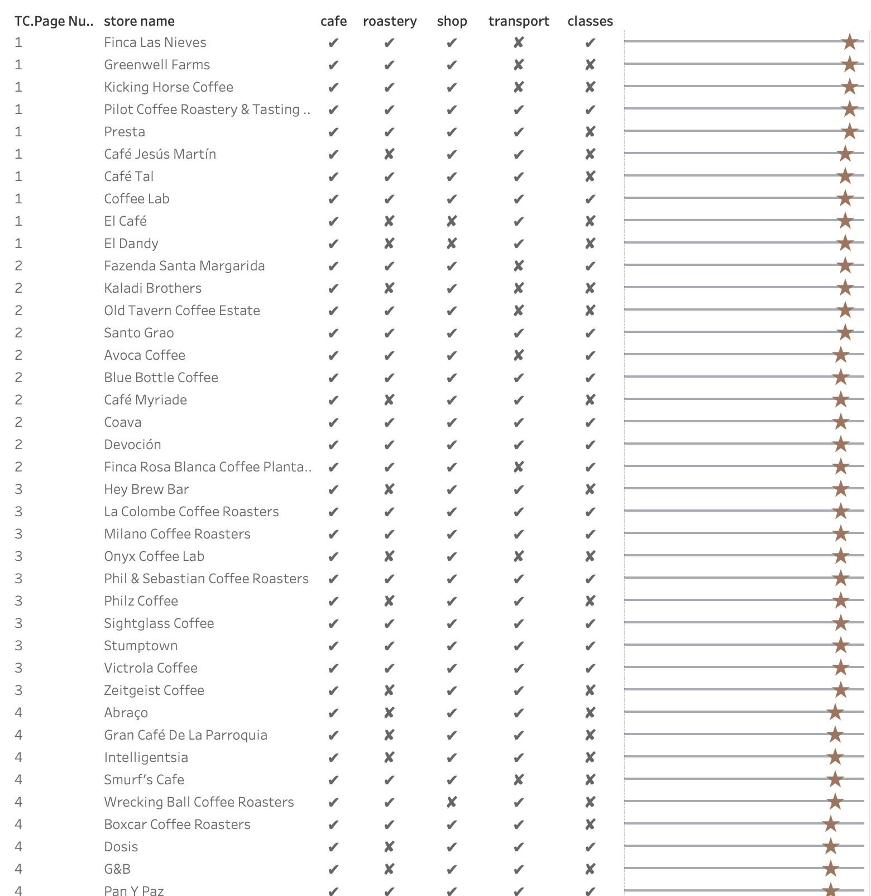
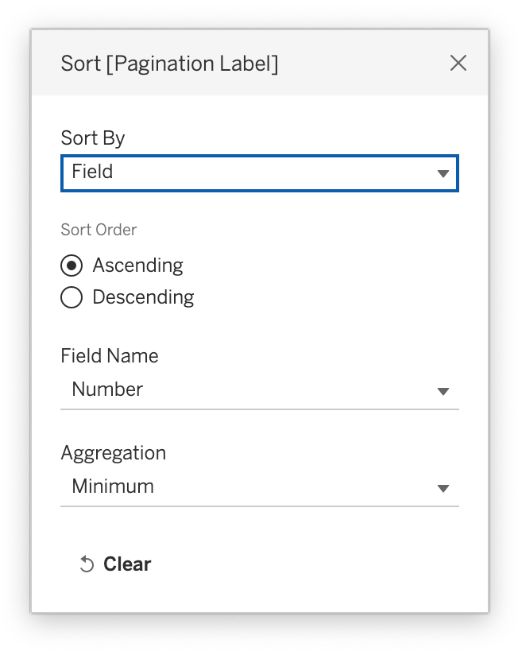
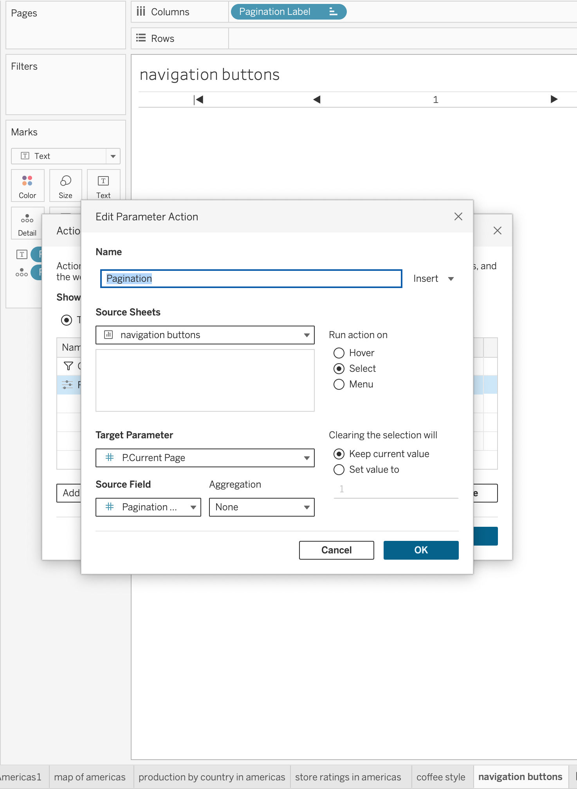
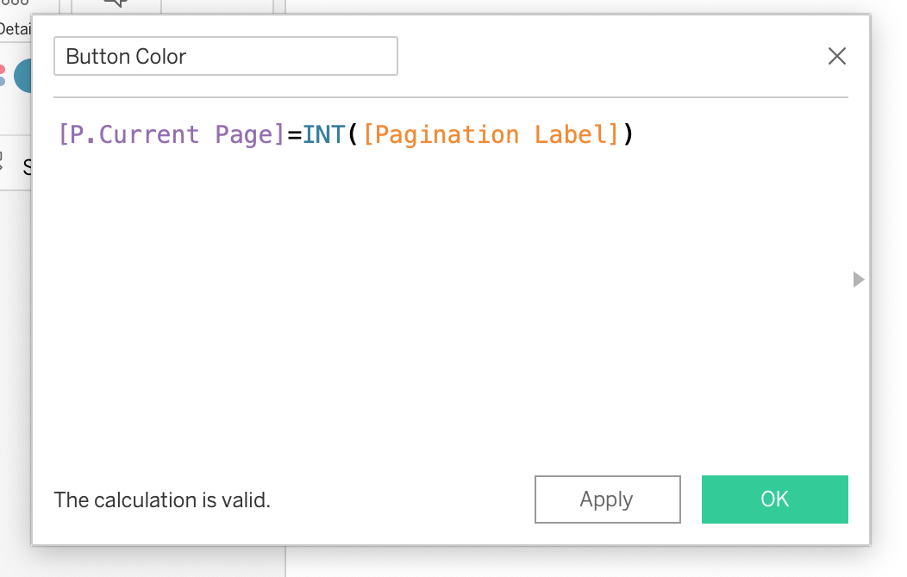
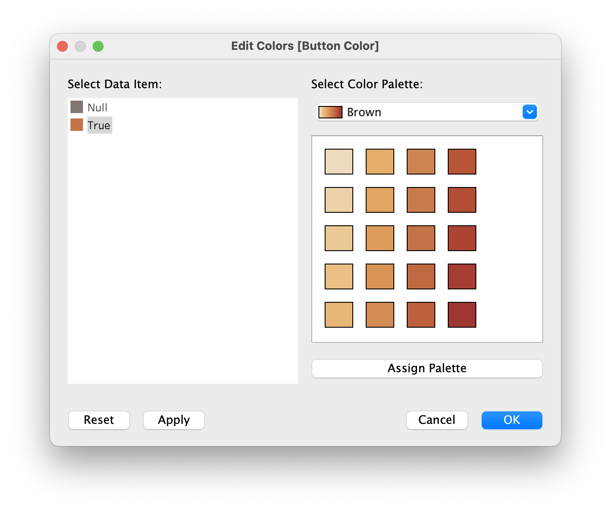

## Brainstorming ideas

In March, 2024, I made it one of my new year resolutions to make at least 10 complete personal projects. I was a data operations specialist, or technically a business analyst. The daily work and ad hoc work involved a lot of data cleaning, since the company I was in was on the progress of building a ERP system but it's still in the earliest stages. While I was wondering in a coffee shop about what other interesting topics I can dive in outside work, having the accessible data and playing around the data without social consequences, I said to myself, why not coffee since I'm a coffee lover?

Since then I browsed through websites and books, searched for data about coffee, ranging from coffee bean production, coffee types, coffee shops, and I came across a book named "*Lonely Planet's Global Coffee Tour*". It's published in 2018, rated high on Amazon, and available in the local library. I borrowed it, read it, and collected information and self-made a table including unique coffee styles in 36 countries across 7 continents, provided services and ratings of 164 coffee shops around the world. ([Google sheet link is here](https://docs.google.com/spreadsheets/d/1L81u0-yGyPNaKl_bZnY8OKhvM4T0b7e2Z52gGJGsGx4/edit?usp=sharing).)

Using this data as the main source, I was hoping to set up a simple coffee info & recommendation system.

## Challenges

### Tableau map limitations when drawing a single continent

What I had in mind is to show one continent at each dashboard, but Tableau doesn't have continent attribute when it comes to draw maps. Good thing is ArcGIS provides shape files for each continent. 

Next thing is to standardize the aliases. For example, in ArcGIS data, North America and South America, as the book mentioned, are both recorded as Americas. Before I put the data in Tableau, firstly I had to align them, so that the same thing has the same name in different data sources.

### Paginate the table in Tableau

As I mentioned above, I collected the information of as many as 164 coffee shops from the book, which cannot be shown in a table at the same time without scrolling your mouse. So what I had in mind is a next/previous button to replace the page scroller. 

1. Create 2 parameters: Page Size and Current Page as below. You could choose a fixed value for page size, or you could make it a parameter to easily change it to the size until it's fit for the design. 

   

2. Using the parameters above to create calculations that get the real page number for each row based on page size you set up. 

   

   If you put it in rows as a discrete variable, you would see every 10 (aka page size) rows are assigned to the same value of page number, which can be used as a filter. 

   

   So to achieve this, create another calculation as a filter, simply by calculating whether the parameter Current Page is equal to the table calculation Page Number and returning a boolean.

   

   If you now drag the Page Filter to Filters and select only True, you could see it's exactly showing the number of rows as the Page Size.

   

   

3. Build the buttons

   1. Firstly, you have to know which page number is the last page so that you won't end up staring at a blank page. 

      

   2. Next, the pagination label using a number placeholder. 

      What I want to achieve is a series of buttons that can do "return to the first page", "to the previous page", an indicator showing the current page number, "to the next page" and "to the last page". 

      The first thing is to find a number placeholder that won't be changed over time or filters. I made up a simple excel sheet and connect it with coffee store data. 

      

      Using it we can create a calculation to give those 5 buttons a shape/number label. Sort the field ascending by Number (1,2,3,4,5). 

      

      

   3. The buttons are correctly shown but each button should be assigned to a real value which can be used to change the current page number parameter. 

      

   4. Set up an action to change parameter.

      

   5. Create a calculation based on which we format the colors.

      

      
      
      