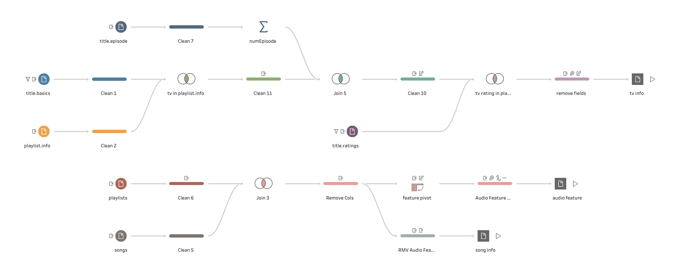
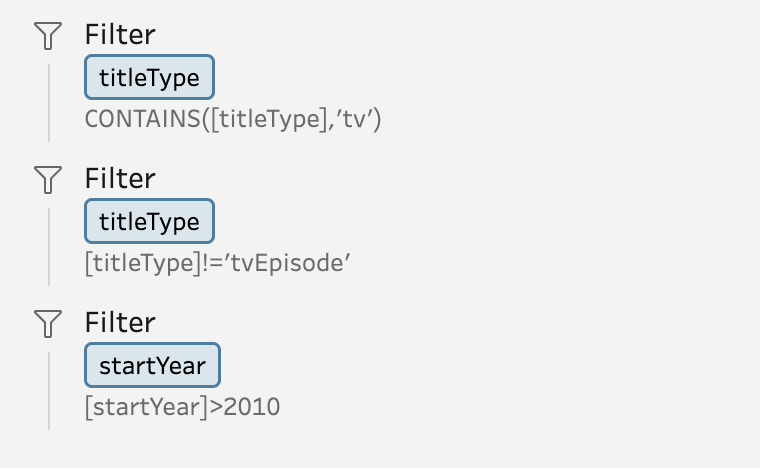
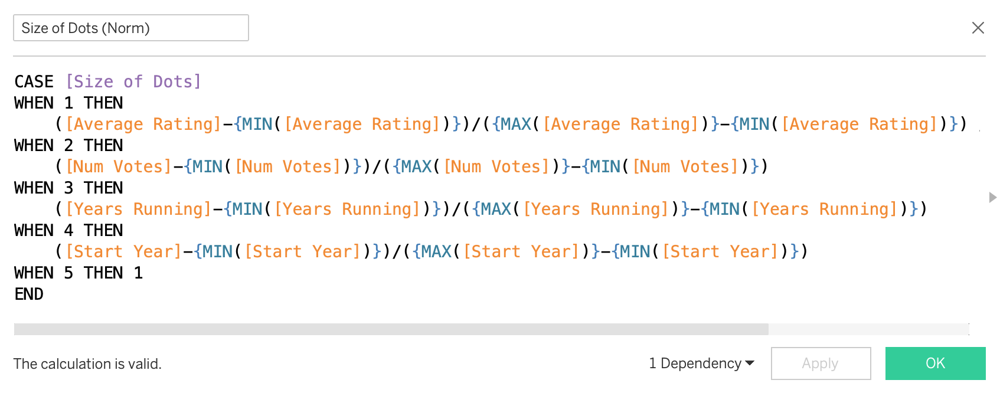

## Dashboards (Tableau Public link [here]())


## Datasets

### IMDb Non-Commercial Datasets

For each TV show's genre and year of release, no dataset is more accessible than IMDb. Subsets of IMDb data are available for access to customers for personal and non-commercial use [here at this link](https://developer.imdb.com/non-commercial-datasets/). The dataset files can be accessed and downloaded from https://datasets.imdbws.com/. The data is refreshed daily.

### Self-Curated Spotify Playlists of Songs From TV Shows I Watched Over the Years

I'm personally a Spotify playlist addict. I love to curate song playlists for different moods, vibes, and seasons, or I make playlists of tracks produced by my favorite artists. Sometimes when I heard great songs playing in TV shows, I would add it into my playlists. And then I developed a habit of making playlists for songs playing in the TV show that I watched. The analysis includes **30+ playlists** curated mainly by me, a.k.a. **[RecmRoom](https://open.spotify.com/user/mn2y0ay9emuhncqd3yqdm2x76?si=3f66f5faf03344a5)** on Spotify. You're welcome to check each playlist on [Google Sheet](https://docs.google.com/spreadsheets/d/1csc2dKC11QIZzjmr3jke3FPXEclEBG82bH2e1kGWEbU/edit?usp=sharing). 

With [Spotify Web API](https://developer.spotify.com/web-api/), you can find details of each song in the playlist including genre, mood, artist, date of release, and other musical attributes. If you want to avoid typing codes, there are several free online tools available, such as [Spotify Playlist Analyzer](https://www.chosic.com/spotify-playlist-analyzer/). By copying and pasting your playlist link in the search box and analyze, it would output all kinds of details and you could also export table as csv. 

## Data Processing

### Playlist info

I handpicked 30+ TV OST playlists from my Spotify profile, and record the title name of the series, the external url of the playlist, platform that the series is released on, and tconst (the alphanumeric unique identifier of the title on IMDb database) which can be related to the IMDb data.

| id   | Series    | Playlist URL                                                 | Platform     | tconst     |
| ---- | --------- | ------------------------------------------------------------ | ------------ | ---------- |
| 1    | Ted Lasso | https://open.spotify.com/playlist/34Vt61ufh30YPJX45e1Om0?si=7b9df5961f8e4308 | Apple TV+    | tt10986410 |
| 2    | Fallout   | https://open.spotify.com/playlist/61SXisE67VXV2j9zt0uyDo?si=1a1af116b1e44630 | Amazon Prime | tt12637874 |

### Stats of Spotify playlists

Initially I tried to fetch data from Spotify Web API using spotipy, however, I was afraid that I'd lose interest while taking up so much time on data preprocessing. So thanks to all the free online convenient tools, I find a Spotify Playlist Analyzer [website](https://www.chosic.com/spotify-playlist-analyzer/) that can analyze a Spotify playlist by simply pasting the playlist link and most of all, it can export the playlist table to CSV. 

It not only includes the basic information, but also includes audio features of each song, provided by Spotify. Detailed descriptions of each feature is documented on [Spotify for Developers](https://developer.spotify.com/documentation/web-api/reference/get-several-audio-features). For the purpose of referencing them on the dashboard, I put them in a table as below.

| audio_feature    | type           | description                                                  |
| :--------------- | -------------- | ------------------------------------------------------------ |
| acousticness     | number [float] | A confidence measure from 0.0 to 1.0 of whether the track is acoustic. 1.0 represents high confidence the track isacoustic. |
| danceability     | number [float] | Danceability describes how suitable a track is for dancing based on a combination of musical elements including tempo, rhythm stability, beat strength, and overall regularity. A value of  0.0 is least danceable and 1.0 is most danceable. |
| duration_ms      | integer        | The duration of the track in milliseconds.                   |
| energy           | number [float] | Energy is a measure from 0.0 to 1.0 and represents a perceptual measure of intensity and activity. Typically,  energetic tracks feel fast, loud, and noisy. For example, death metal has  high energy, while a Bach prelude scores low on the scale. Perceptual features contributing to this attribute include dynamic range, perceived loudness,  timbre, onset rate, and general entropy. |
| instrumentalness | number [float] | Predicts whether a track contains no vocals. "Ooh" and "aah" sounds are treated as instrumental in this context. Rap or spoken word tracks are clearly  "vocal". The closer the instrumentalness value is to 1.0, the greater likelihood the track contains no vocal content. Values above 0.5 are intended to represent instrumental tracks, but confidence is higher as the value approaches 1.0. |
| key              | integer        | The key the track is in. Integers map to pitches using standard [Pitch Class](https://en.wikipedia.org/wiki/Pitch_class) notation. E.g. 0 = C, 1 = C♯/D♭, 2 = D, and so on. If no key was detected, the value is -1. |
| liveness         | number [float] | Detects the presence of an audience in the recording. Higher liveness values represent an increased probability that the track was performed live. A value above 0.8 provides strong likelihood that the track is live. |
| loudness         | number [float] | The overall loudness of a track in decibels (dB). Loudness values are averaged across the entire track and are useful for comparing relative loudness of tracks. Loudness is the quality of  a sound that is the primary psychological correlate of physical strength (amplitude). Values typically range between -60 and 0 db. |
| mode             | integer        | Mode indicates the modality (major or minor) of a track, the type of scale from which its melodic content is derived. Major is represented by 1 and minor is 0. |
| speechiness      | number [float] | Speechiness detects the presence of  spoken words in a track. The more exclusively speech-like the recording (e.g.  talk show, audio book, poetry), the closer to 1.0 the attribute value. Values above 0.66 describe tracks that are probably made entirely of spoken words. Values between 0.33 and 0.66 describe tracks that may contain both music and  speech, either in sections or layered, including such cases as rap music. Values below 0.33 most likely represent music and other non-speech-like  tracks. |
| tempo            | number [float] | The overall estimated tempo of a track in beats per minute (BPM). In musical terminology, tempo is the speed or pace of a given piece and derives directly from the average beat duration. |
| time_signature   | integer        | An estimated time signature. The time signature (meter) is a notational convention to specify how many beats are in each bar (or measure). The time signature ranges from 3 to 7 indicating time signatures of "3/4", to "7/4". |
| valence          | number [float] | A measure from 0.0 to 1.0 describing the musical positiveness conveyed by a track. Tracks with high valence sound more positive (e.g. happy, cheerful, euphoric), while tracks with low valence sound more negative (e.g. sad, depressed, angry). |

After exporting all 30 playlist songs to CSVs and format all file names as *[TITLE]\_TV\_\[PLATFORM].csv*, I used Python to quickly union them into one sheet and reformat the dates of album release and songs being added to the playlist. 

```python
playlists = os.listdir("../data/playlists/")
df = pd.DataFrame()
for p in playlists:
    if p.endswith('.csv'):
        tv = p.split("_")[0]
        platform = p.strip(".csv").split("_")[-1]
        temp = pd.read_csv("../data/playlists/"+p)
        temp['TV Show'] = tv
        temp['Platform'] = platform
        df = pd.concat([df,temp],axis=0,ignore_index=True)
```

```python
def date_formatter(str):
    str = str.replace("00-00","01-01") # 2023-00-00
    str = str.replace("-00","-01") # 2023-12-00
    if len(str)==10: # 2023-12-25
        str_time = pd.to_datetime(str, format='%Y-%m-%d', errors='coerce')
    elif "/" in str: # 12/25/23
        str_time = pd.to_datetime(str, format='%m/%d/%y', errors='coerce')
    else:
        str = str+"-01" # 2023-12
        str_time = pd.to_datetime(str, format='%Y-%m-%d', errors='coerce')
    return str_time
```

I noticed that duration time of each song is not nicely formatted, so I wrote a quick function to convert it to duration in ms. 

```python
def time_to_duration_in_ms(string):
    minute, second = string.split(":")
    duration = (int(minute)*60+int(second))*1000
    return duration
```

### Join IMDb data

IMDb dataset is too large and overabundant for this project so I used Tableau Prep to do a bit of joining and filtering before importing data in Tableau. 



Tableau Prep will automatically and forcibly sample and bring a subset of large dataset into the flow. It will make the data flow efficient, and when you run the flow and generate an output, Tableau Prep will supposedly process all the records in your data set. However, it may show results that's misleading to users when you try to do joins. For example, when I pull IMDb in the flow and join it with playlist info, the randomly sampled subset doesn't have the rows containing the tv shows I need so that the preview result will possibly show a blank table. 

So I tried to filter unnecessary rows as many as I can at the input step, for example, I know the TV shows included are all born after 2010, so I filtered as below. 



### Preprocess audio features

In the final presentation, I want it to be able to show a radar map for each series, getting a sense of the average distribution of audio features of songs playing in the series. Or perhaps a grid of radar maps, each map showing a song from the series, ordered by popularity. Either way, I need to preprocess the values and table structure of audio features. All the audio features picked from Spotify database need to be readjusted to the same range, for example, 1-100 or 0-1. There are only at most 7 measures fit for the analysis, shown as below.

| Measure | Audio Feature Name | original audio feature Name |
| ------- | ------------------ | :-------------------------- |
| 1       | Acoustic           | acousticness                |
| 2       | Dance              | danceability                |
| 3       | Energy             | energy                      |
| 4       | Happy              | valence                     |
| 5       | Instrumental       | instrumentalness            |
| 6       | Live               | liveness                    |
| 7       | Speech             | speechiness                 |

## Dashboard Design 

I want to try new graphs in this design and also showcase features of both playlist in different tv shows and song features of each playlist. I also want to be able to reuse the template every time a new playlist is created so that I can simply update the data without touching the layout. 

I chose portrait size (4:5) of Instagram feed post, 1080 x 1350 pixels, as the size of my dashboard. I drafted a few pages on paper and the main ideas are in the following:

1. The first page, to show the cross analysis of tv *ratings* in IMDb and *popularities* of the songs it picked, is designed to be a **scatter plot**, with some introduction and summary. Users can select one of the points to filter the tv series in the next pages. 
2. A **radar map** shows 7 audio features of the songs in the tv show selected on the first page. 
3. A sunburnt / radial / polar chart for genre distribution.
4. A bar chart for song decades.
5. Pixelated theme.
6. Embedded Spotify widget to click and play the playlists.

### Normalize data in Tableau

In the first introduction page, I plan to do a scatter plot as [The IMDb Explorer](https://public.tableau.com/app/profile/westlake.cjw/viz/TheIMDbExplorer/TheIMDbExplorer) so that users can select the variables or show bubbles indicating different metrics that allow them to explore and compare with the average popularity of the soundtrack songs. However, the variables I choose, for example number of votes and average rating, have totally different range, so data normalization or standardization is a must. 



## Inspirations

Thanks to [Emanuela Blaiotta](https://public.tableau.com/app/profile/emanuela8569)'s [A week in music - Spotify API](https://public.tableau.com/app/profile/emanuela8569/viz/Aweekinmusic-SpotifyAPI/Spotify), I get to know that it's even possible to embed Spotify in Tableau dashboard. 

Thanks to the Tableau community and Iron Viz finalists, especially Chris Westlake's Final [The IMDb Explorer](https://public.tableau.com/app/profile/westlake.cjw/viz/TheIMDbExplorer/TheIMDbExplorer) for the inspirations. 

Thanks to the Figma community and most of all, [hackernoon](figma.com/@hackernoon), for the amazing pixel icons and pixelated theme ideas. 
