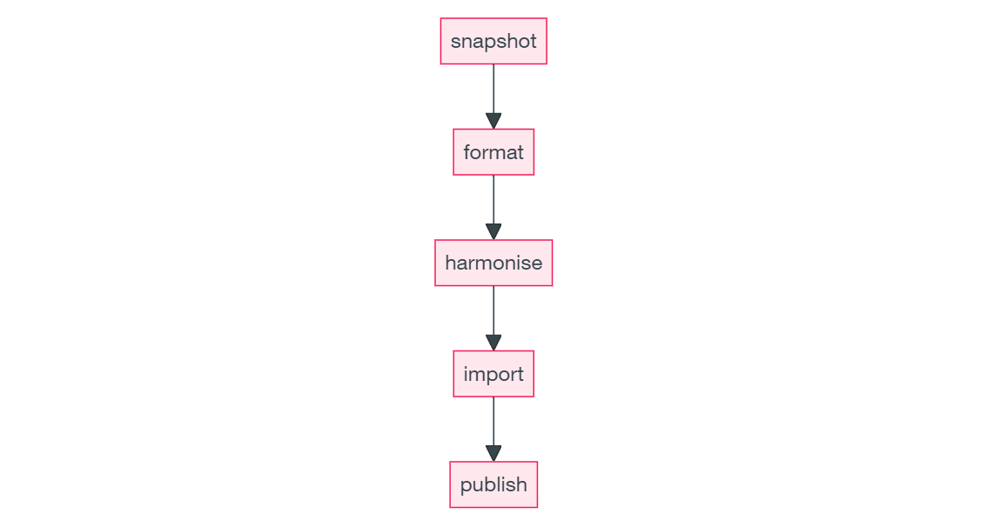

Our World in Data is a platform of publication to see the large global problems and the powerful changes that reshape our world. They present accessible and understandable data with standardized graphs for people of interest and researchers, etc. Their design principles and way of organizing data are valuable to learn from so I made a little note of how they do their daily data work. 

## ETL Model

In general, an ETL consists of three main processes:

- **Extract**: Downloads data from a source or multiple sources.
- **Transform**: Processes and combines the downloaded data so it is usable.
- **Load**: Moves the transformed data to a data repository (e.g. database).

In owid's practice, it can be transformed into 3 main building blocks:

- [**Snapshots**](#snapshots): download files from external sources and store them as snapshots.
- [**Datasets**](#datasets): Next, curate the downloaded data to have clean datasets. These datasets can depend on snapshots, but also on other curated datasets.
- [**Visualization (Grapher views)**](#grapher-views): adapt the curated datasets for any visualization software or platform and then loaded to it. Owid developed their own platform [Grapher](https://ourworldindata.org/owid-grapher).

### Snapshots

Snapshots represent a copy of an upstream data file ー preserving its original format ー at a particular point in time. That is, they are entry points to the ETL, and therefore don't have dependencies within the computational graph.

#### DVC

Snapshots are managed in the ETL using DVC (Data Version Control), which allows tracking of different file versions and metadata.

[Their URI](https://docs.owid.io/projects/etl/architecture/design/uri/#path-for-snapshot) begins with the prefix `snapshot://`, therefore using the following format:

```
snapshot://<namespace>/<version>/<filename>
```

### Datasets

Datasets are nodes in the computational graph and the main units of work in the ETL. They represent a transformation from one or more ingredients into a new (and potentially better and more useful) output.

[Their URI](https://docs.owid.io/projects/etl/architecture/design/uri/#path-for-data) begins with the prefix `data://`, and use the following convention:

```
data://<channel>/<namespace>/<version>/<dataset-name>
```

The `channel` is used as the highest level of grouping and represents a stage of data curation. This will either be `meadow` or `garden`. The `namespace` is typically a data provider, like `un`, but it in cases where there are many data providers, it can describe the topic area instead (e.g. `energy`).

## ETL Steps

### Five stages

The ETL project provides an opinionated data management workflow, which separates a data manager's work into five stages:



The design of the ETL involves steps that mirror the stages above, which help us to meet several design goals of the project:

1. [Snapshot step](#snapshot-step): Take a **snapshot** of the upstream data product and store it on our end.
2. [Meadow step](#meadow-step): Bring the data into a **common format**.
3. [Garden step](#garden-step): **Harmonise** the names of countries, genders and any other columns we may want to join on. Also do the necessary data processing to make the dataset usable for our needs.
4. [Grapher step](#grapher-step): **Import** the data to internal MySQL database.

#### Snapshot step

The initial step in importing data from an upstream source involves **transferring an external file directly into our platform**. This process is essential to ensure both reliable and secure access to the file.

It's important to recognize that an external source might remove the file at any time. Furthermore, this method supports the reproducibility of all Extract, Transform, Load (ETL) processes. This is crucial because the content of the file at the source may undergo changes, such as the removal or addition of datapoints, or alterations in field names.


The snapshot step typically consists of a DVC file and a script that downloads the upstream data and saves it to our snapshot catalog. Snapshot files are located in the [`snapshots/`](https://github.com/owid/etl/tree/master/snapshots) directory of the project.

Note that we need a DVC file per upstream data file; hence, in some instances, if the source publishes a dataset using multiple files, we need multiple DVC files.
