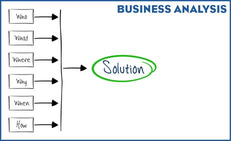

Typically, business analysts (BAs) are members of a project management team and play a significant role in the project lifecycle. Their job is to help enable change in an enterprise. 

The change can be big, like converting an acquired company’s financial system to Salesforce. Or the change can be something small, like enabling sales managers to **make forecast adjustments**. Or it can be something in between, like **improving a business process or solving a current or future business problem**. Whatever the scale, if the change involves **improving or streamlining a process (business driven) or system (IT driven)** to help organizations meet their target goals, a business analyst can steer the project in the right direction. 

## Top Skills of the Business Analyst

Let’s start with a high-level view of some of the most important skills that BAs use to work effectively with both people and information to facilitate a solution to a problem. 

**Information Discovery**

To make informed decisions and recommendations, business analysts need to gather information, lots of information, from all levels. This is one of the most important steps in the business analyst process, so they must do it well.

**Analysis and Synthesis**

Business analysts spend significant effort looking through the information that they’ve gathered. They look at both the details and the high-level information to chart needs and to develop plans and schedules. They also look at the skills and experience of the people involved to determine how the team can best work together to achieve a successful outcome.

**Communication, Collaboration, and Documentation**

Business analysts must communicate clearly and efficiently to everyone involved. They need to document and share information so that stakeholders and other involved parties have a clear understanding of the project, the goals, and the proposed solution. BAs help improve overall productivity by breaking down the barriers to communication.

In this unit, you got a high-level look at what a successful business analyst does and some of the skills they use. We explore each of these skills in detail in the next units.

## Information Is Important

> “In the absence of information, we jump to the worst conclusions.” —Myra Kassim, Writer

You just learned that a business analyst plays a significant role in the project lifecycle and that one of the most important phases in the lifecycle is information discovery. It is during this phase that you, as an analyst, do most of the groundwork for a project.

Having the right information is key to the success of a project. Without it, you cannot form the best conclusions and bring a project to fruition. You might not even be able to form a conclusion at all.

So what type of information do you need and how do you acquire it? Simply put, as a business analyst you gather as much information as possible by exploring all areas of the project. Typically, you ask every who, what, where, why, when, and how question you can think of about the subject. For instance:

**Who:** Who are the stakeholders? Who is involved? Who follows the process? Who hands things off?

**What:** What is done first? What is done next? What is the problem that we are trying to solve?

**Where:** Where is the information input? Where does the information go after it is input? Where would a person be when doing this?

**Why:** Why are we doing this? Why is this important?

**When:** When does this happen? (Once a week? Every first day of the month?) When do we need a solution?

**How:** How does this work now? How should this work?

The answers to all these questions give the business analyst a good cross section of data that helps move the project toward the best solution.

## Where to Find Key Information

> “Intelligence is not the ability to store information, but to know where to find it.” —Albert Einstein

Project information is the agent of change. It’s what drives the solution and ultimately the change in the business. But before it can be the change agent, it must be found. Information comes in all shapes and sizes and from countless sources, including project information, requirements, analyses, and processes. It also originates from a variety of people, including subject matter experts and stakeholders.

For ease, let’s group the information areas into three high-level categories: project history, analysis, and elicitation. 

**Project History**

Whether you’re creating a new product or service or enhancing an existing one, it’s crucial to gather a significant amount of background information on the project, either from stakeholders or other sources. This is known as the project history, or sometimes project orientation. 

This type of information ensures that you don’t inadvertently repeat work that’s already been done or rehash previous decisions. It also helps you understand the existing systems, design, requirements, and business processes. The more you know, the better your analysis, and therefore, the better the outcome of your project. Do as much research as you can about the existing situation and the desired improvement. Learn the processes and systems involved to get as much insight as you can into how the business operates and how the systems work.

**Analysis**

To learn and understand as much as possible about a project, the business analyst (BA) performs various types of analyses. 

**Enterprise Analysis**

As a BA, you need to learn and understand an organization’s structure, including who reports to whom, and the functions and interactions of departments within the organization. The information you gain here helps your team successfully collaborate and communicate (more on those in the next unit).

**Strategy Analysis**

This is about getting to the heart of the problem. It’s about understanding. First, you identify the need of strategic or tactical importance—the business need. This is an important first step; the business need guides the rest of the project.

Then, you observe the current state and define the future and transition states that will address the business need. This is a gap analysis—identifying what is different between the current and desired state. Now, assess options for achieving the desired state, including the work or scope required, and recommend the highest value approach for reaching that state.

The BA should also assess the risks associated with the identified change solution and what effect those uncertainties might have on the project lifecycle or end goal. Develop a plan of action to address the potential risks.

**Stakeholder Analysis**

Stakeholders are the individuals or groups (internal or external to the immediate organization) who make decisions and who have an important role in determining the priorities and requirements for your project. Because of this, it is essential to identify the stakeholders early on. To identify your stakeholders, start with this measurement: anyone who has an interest in, or may be affected by, the issue under consideration. 

Here are some examples of stakeholders.

| **Role**   | **Internal/External** | **Examples**                           |
| ---------- | --------------------- | -------------------------------------- |
| Owner      | Internal              | Founder, chairperson, director         |
| Manager    | Internal              | CXO, executive, manager                |
| Employee   | Internal              | Staff, team, department, group         |
| Competitor | External              | In the same or other industry/market   |
| Customer   | External              | Buyers and users of products/services  |
| Partner    | External              | Alliances and partner organizations    |
| Supplier   | External              | Vendors who supply raw materials/parts |
| Regulator  | External              | Regulating and governing bodies        |

You can use a stakeholder wheel to help you recognize each stakeholder and the level of influence they can have on the project.

**Elicitation**

When you research a topic for a term paper at school, usually you can gather information easily from a library or online sources. But information for a business analyst is often not so easy to come by. Many of the business or technical requirements are in the minds of stakeholders or end users—they are seldom documented anywhere. When the information you need as a business analyst is not readily available, it must be elicited.

In the business analyst world, information discovery is known as elicitation, which means to draw forth or bring out. It is one of the most important phases for a BA. Per the BABOK (Business Analysis Body of Knowledge) Guide, elicitation “is the drawing forth or receiving of information from stakeholders or other sources. It is the main path to discovering requirements and design information, and might involve talking with stakeholders directly, researching topics, experimenting, or simply being handed information.”

There are many elicitation techniques that you can use. As a business analyst, you first determine the project needs and then choose the elicitation method or methods that support your project the best. Some of these methods are:

| Brainstorming Document analysis Focus groups Interface analysis Interviews Observation Process modeling Prototyping Requirements workshops Surveys/questionnaires |  |
| ------------------------------------------------------------ | ------------------------------------------------------------ |

It’s important to note that elicitation is not an isolated or compartmentalized activity. You elicit project information while performing any task that includes interaction with stakeholders and during your independent analytical work. Initial elicitation may trigger additional elicitation to gather the details, fill in gaps, or increase understanding. The key is to be open to adding informed information throughout the lifecycle of your project.

Elicitation is typically performed in three general stages.

1. Prepare for elicitation - gather a comprehensive and accurate understanding of the project’s business need.
2. Conduct elicitation - meet with stakeholders to elicit information regarding their needs and the needs of the business.
3. Confirm elicitation results - validate that the stated requirements match the problem and needs and ensure that the understanding conforms to the actual desires or intentions of the stakeholders.

Elicitation is your underlying research for the next phase of the process: requirements creation. Once you have sufficient material, you can begin crafting and documenting requirements.

Hopefully, you now have a sense of why information is important for the business analyst, as well as how to discover it. A skilled business analyst knows the types of information required for each project and how to access it to reach the project goal. Next, we visit another business analyst skill: communication.

## Types of Documentation

The types of documentation you create depend on varied factors, including:

- Type of project
- The business need
- Stakeholder needs
- Assumptions
- Constraints

There’s a myriad of document types that can be important to a business analyst. They range from printed documents to information repositories to collections of screenshots to websites and blogs containing company and department information. For each project, you create and use only the types of documents that are most appropriate. 

Let’s look at some specific examples. For other examples of documents that a business analyst creates, see the Resources section in this unit.

| **Document Type**                                     | **What It Is**                                               |
| ----------------------------------------------------- | ------------------------------------------------------------ |
| Glossary of terms                                     | This is a list of key terms and definitions that boosts understanding across teams involved in the project. |
| RACI chart                                            | RACI stands for responsible, accountable, consulted, and informed. It’s a matrix that delineates who is responsible for what in the context of the business analysis effort. Responsible: A person who performs an activity or does the work. Accountable: A person who is ultimately accountable for the outcome Consulted: A person who needs to provide feedback or contribute to the activity. Informed: A person who needs to know of a decision or action. |
| Interview and elicitation records                     | These documents capture important information from stakeholders. |
| Stakeholder analysis                                  | This document identifies:Who you should talk with to understand the business problemWho can help flesh out the requirementsThe individuals who can give you a range of perspectives |
| User stories                                          | A user story describes the functionality that a business system should provide so that it can be developed. It is often called a ticket or work item. The format is “As a….  I want to…  So that I can…” |
| Use cases                                             | A use case identifies, defines, and organizes the system requirements from the perspective of a user. |
| Business analysis plan                                | This plan lists all the business analysis activities that will take place throughout the project. |
| Current state analysis                                | If the current business process or domain is not well understood, the BA analyzes and documents the current state before scoping a project to improve upon it. |
| Scope statement specification                         | This is the most fundamental deliverable on any project. It is a clear definition of what needs to be achieved and the work that must be done to deliver the project or product. |
| Functional requirements specification (FRS)           | This is the business requirements that are defined from an end user or business perspective. It will specify the expected outcomes. |
| System requirements specification (SRS)               | This document details how the complete system should function and enumerates hardware, software, and functional and behavioral requirements of the system. |
| Gap analysis document                                 | This document describes the gaps between the current processes and the intended processes. |
| Change request logs                                   | This document is a log of all the change requests in the project including date of request, requester, and any other key information. |
| Wireframes and other visual documentation             | This document contains renderings of the user interface, often in the form of low-fidelity wireframes. |
| Test plans, test cases, or user acceptance test plans | These documents describe the test plans and detailed test cases that the team will use to validate the functional requirements. |
| Change management                                     | This document describes the method for pushing out changes to the business. |