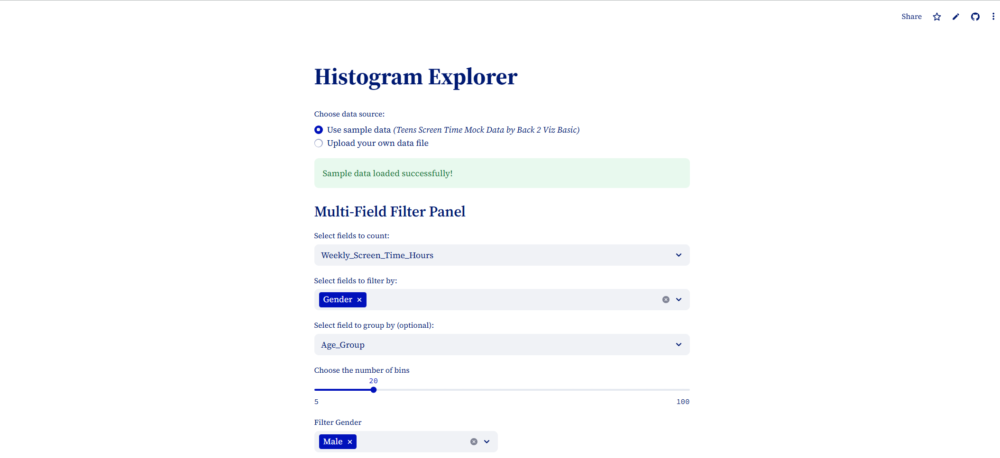

# Building an Interactive Histogram Explorer with Streamlit

Data visualization is fundamental to understanding your datasets, and histograms are among the most powerful tools for exploring data distributions. However, creating multiple histograms with different parameters and filters often requires writing repetitive code or juggling between different tools.

That's why I built the <u>***[Histogram Explorer](https://histogram-explorer.streamlit.app/)***</u> – a streamlined web application that lets you explore data distributions interactively through your browser. Whether you're analyzing sample data or your own datasets, this tool makes histogram exploration intuitive and efficient. You can check out the complete project and code on *<u>**[GitHub](https://github.com/aoyingxue/histogram-explorer)**</u>*.

Beyond the practical need for better data exploration tools, this project served another important purpose: **me reconnecting with Streamlit**. During my graduate studies, I had used Streamlit to build an interactive data analysis web application for a competition. However, after entering the workforce, I hadn't revisited this technology stack. When I recently discovered an interesting screen time dataset shared by the data community, I saw the perfect opportunity to dust off my Streamlit skills. Instead of reaching for my go-to tool Tableau, I chose to challenge myself with Streamlit development, leveraging AI-assisted coding to accelerate the implementation process.



## Project Purpose and Goals

The Histogram Explorer was designed with a clear mission: **make histogram-based data exploration accessible and interactive for everyone**. The tool addresses several common pain points in data analysis:

- **No coding required**: Upload your data and start exploring immediately
- **Interactive filtering**: Apply multiple filters and see results instantly
- **Flexible grouping**: Compare distributions across different categories
- **Professional visualizations**: Generate publication-ready plots with statistical annotations
- **Sample data included**: Get started immediately with built-in example data

The application runs entirely in your browser, making it accessible from anywhere without complex installations or dependencies.

## Code Architecture and Implementation

Let me walk you through the key components of the application and explain how each section contributes to the overall functionality.

### Project Setup and Configuration

```python
import streamlit as st
import pandas as pd
import seaborn as sns
import matplotlib.pyplot as plt
import numpy as np

st.set_page_config(
    page_title="Histogram Explorer",
    layout="centered",
)
```

The application starts with essential imports, combining Streamlit for the web interface, pandas for data handling, and seaborn/matplotlib for beautiful statistical visualizations. The centered layout provides a focused, clean appearance that works well across different screen sizes.

### Custom Styling and Chinese Font Support

```python
st.markdown(
    """
        <style>
            [data-testid="stDecoration"] {
                background: #FFFFFF;
            }
        </style>
    """,
    unsafe_allow_html=True,
)

plt.rcParams['font.sans-serif'] = ['SimHei']
plt.rcParams['axes.unicode_minus'] = False 
```

This section demonstrates thoughtful UI customization. The CSS removes Streamlit's default colorful header decoration for a cleaner look, while the matplotlib configuration ensures proper Chinese character rendering – essential for international datasets or bilingual analysis.

### Core Visualization Function

```python
def plot_histogram(data, ax, bin_count):
    sns.histplot(data.dropna(), bins=bin_count, kde=True, ax=ax) 
    counts, bins = np.histogram(data.dropna(), bins=bin_count)
    for count, bin_left, bin_right in zip(counts, bins[:-1], bins[1:]):
        ax.text(
            (bin_left + bin_right) / 2,
            count,
            str(count),
            ha='center',
            va='bottom',
            fontsize=10,
        )
    ax.set_xticks(bins[::max(1, len(bins)//10)])
    ax.set_xticklabels([f"{b:.0f}" for b in bins[::max(1, len(bins)//10)]])
    return ax
```

This is the heart of the visualization engine. The function creates publication-quality histograms with several key features:

- **Kernel Density Estimation (KDE)**: The smooth curve overlay helps identify the underlying distribution shape
- **Automatic Frequency Labels**: Each bar displays its exact count, providing precise numerical insight
- **Smart Tick Management**: X-axis labels are intelligently spaced to prevent overcrowding
- **Missing Data Handling**: `dropna()` ensures robust performance with incomplete datasets

The combination of seaborn's statistical plotting capabilities with custom annotations creates visualizations that are both beautiful and informative.

### Flexible Data Source Management

```python
option = st.radio(
    "Choose data source:",
    ['Use sample data *(Teens Screen Time Mock Data by Back 2 Viz Basic)*', 'Upload your own data file'],
    index=0,
)

if option == 'Upload your own data file':
    uploaded_file = st.file_uploader("Upload a data file (CSV or xlsx)", type=["xlsx", "csv"])
```

The data source selector provides maximum flexibility. Users can either explore the application immediately with sample data or upload their own files. Supporting both CSV and Excel formats covers the vast majority of common data scenarios, while the radio button interface keeps the choice clear and simple.

### Efficient Data Loading with Caching

```python
@st.cache_data
def get_data(source_option, uploaded_file):
    if source_option == 'Use sample data *(Teens Screen Time Mock Data by Back 2 Viz Basic)*':
        df = pd.read_csv("data/teens_screen_time.csv")
    else:
        if uploaded_file is not None:
            df = pd.read_csv(uploaded_file) if uploaded_file.name.endswith(".csv") else pd.read_excel(uploaded_file)
    return df
```

The `@st.cache_data` decorator is crucial for performance. It ensures data files are only loaded once, even when users interact with different controls. This caching mechanism prevents unnecessary file re-reading and keeps the application responsive, especially important for larger datasets.

### Intelligent Field Classification

```python
numeric_fields = df.select_dtypes(include=[np.number]).columns.tolist()
categorical_fields = df.select_dtypes(include=['object']).columns.tolist()

select_col = st.selectbox("Select fields to count:", options=numeric_fields)
select_fields = st.multiselect("Select fields to filter by:", options=categorical_fields)
```

The application automatically distinguishes between numeric and categorical fields, presenting users with only appropriate options. This prevents common errors (like trying to create histograms of text fields) while guiding users toward meaningful analysis choices.

### Advanced Filtering System

```python
if select_fields and select_col:
    cols = st.columns(2)
    filters = {}
    
    for i, field in enumerate(select_fields):
        with cols[i % 2]:
            col_options = df[field].drop_duplicates().sort_values(ascending=True)
            selected_options = st.multiselect(f"Filter {field}", options=col_options, default=col_options[0])
            filters[field] = selected_options
```

The filtering system is both powerful and user-friendly. Multiple categorical filters can be applied simultaneously, with each filter displaying its unique values in sorted order. The two-column layout maximizes screen space while maintaining readability, and the default selection ensures users see results immediately.

### Dynamic Group-Based Analysis

```python
group_field = st.selectbox(
    "Select field to group by (optional):", 
    options=[i for i in categorical_fields if i not in select_fields]+["None"]
)

if group_field == None:
    # Single overall histogram
    fig, ax = plt.subplots(figsize=(14, 8))
    data = filtered_df[select_col]
    plot_histogram(data, ax, bin_count)
    st.pyplot(fig)
else:
    # Multiple grouped histograms
    group_values = filtered_df[group_field].drop_duplicates().sort_values(ascending=True).tolist()
    cols = 2
    rows = (len(group_values)+1)//2
    
    fig, axs = plt.subplots(nrows=rows, ncols=cols, figsize=(14, 6*rows))
    axs = axs.flatten()
    
    for i, value in enumerate(group_values):
        ax = axs[i]
        data = filtered_df[(filtered_df[group_field]==value)][select_col]
        ax = plot_histogram(data, ax, bin_count)
        ax.set_title(f"{value}", fontsize=16)
    
    # Hide unused subplots
    for j in range(i+1, len(axs)):
        axs[j].axis('off')
```

This is where the application really shines. Users can choose to view either a single histogram of all filtered data or multiple histograms grouped by a categorical variable. The grouped view automatically calculates the optimal subplot layout and handles edge cases like unused subplot areas.

The intelligent field filtering ensures that grouping fields don't conflict with active filters, preventing logical inconsistencies in the analysis.

### Professional Layout and Spacing

```python
plt.tight_layout(
    pad=3.0,
    h_pad=4.0,
    w_pad=1.5,
)
```

The layout parameters ensure that multiple histograms display clearly without overlapping labels or titles. This attention to visual detail makes the difference between amateur-looking plots and publication-ready visualizations.

## Conclusion

The Histogram Explorer demonstrates how modern web frameworks like Streamlit can make powerful data analysis accessible to everyone. By combining intuitive interface design with robust statistical visualization capabilities, this project bridges the gap between complex analysis and user-friendly exploration.

For me personally, this project was a successful return to Streamlit development, proving that with the right tools and AI assistance, we can quickly build meaningful applications that solve real data analysis challenges. The combination of rediscovering past skills and leveraging modern development approaches made this both a technical and learning success.

------

*Ready to explore your data distributions? Check out the [Histogram Explorer on GitHub](https://github.com/aoyingxue/histogram-explorer) and start discovering patterns in your datasets!*

