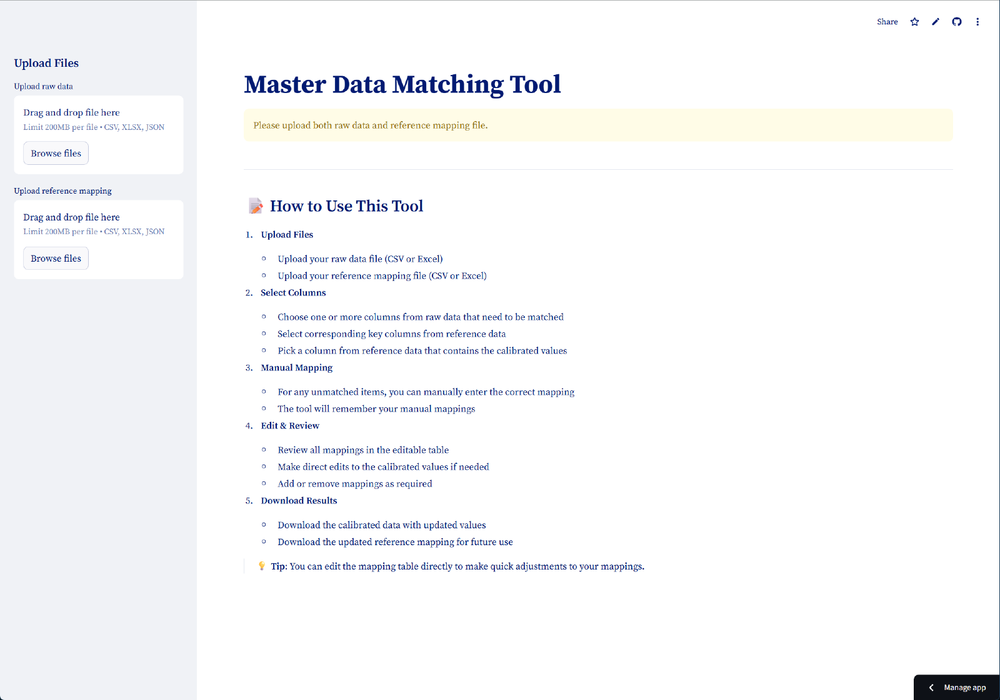
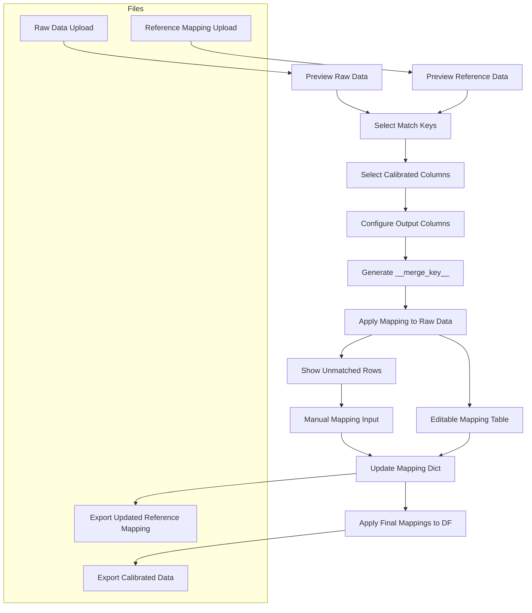

I often work with tabular data that needs to be “aligned” — matching messy entries like inconsistent customer names, city names, or codes against a standard reference. To save time and reduce manual Excel cleaning, I built a [***<u>Streamlit web app</u>***](https://data-matching.streamlit.app/) for me and my team. It matches raw data to reference mapping data file, supports manual input, and exports the cleaned results — all in-browser.

## What This App Does

This simple app is designed for **data analysts**, **operations**, or anyone who deals with messy spreadsheets and reference tables.

You can use it to:
- Upload raw data + a reference mapping
- Select one or more matching key columns
- Automatically match and apply calibrated values
- Manually fill unmatched entries in-browser
- Edit mappings directly in a preview table
- Export calibrated data + updated mapping table (CSV / Excel / JSON)

### Example Use Cases

- Match customer names to official company groups
- Map free-form country/city fields to standardized codes
- Standardize internal product SKUs using a master list

### File Types Supported
- `.csv`, `.xlsx`, `.json` for both raw data and mapping reference
- Sheet selection for Excel
- Transposition toggle for JSON (to handle nested formats)



## How It Works

Let’s walk through the main stages of the app, based on `main.py`.

### File Upload & Sheet Selection

```python
st.sidebar.file_uploader(...)
```

- Two upload boxes: `raw data` and `reference mapping`
- Supports CSV, Excel (with sheet selector), JSON (with transpose option)
- Uses `pandas` to load the files

### Preview Section

```
pythonCopyEditst.dataframe(df_raw.head())
st.dataframe(df_ref.head())
```

- Shows first few rows of both datasets side by side
- Also displays their shapes (`(rows, columns)`)

### Match Key Selection

```
raw_cols = st.multiselect(...)
ref_cols = st.multiselect(...)
```

- Choose one or more columns from both datasets to serve as match keys
- They’re combined into a string-based `__merge_key__`

```
df_raw["__merge_key__"] = ...
df_ref["__merge_key__"] = ...
```

This becomes the central point of mapping.

### Define What to Calibrate

```
ref_value_cols = st.multiselect(...)
```

- Choose which field(s) in the reference table will be applied as “calibrated values”
- You then configure whether to:
  - Replace an existing column
  - Add as a new column
  - Optionally retain the original

All of this is defined in `output_config`.

### Automatic Matching Logic

```
result_df = df_raw.copy()

for config in output_config:
    if config["is_new"]:
        result_df[config["new_col"]] = ...
    else:
        ...
```

- Applies calibrated values by mapping `__merge_key__` to the chosen reference field
- Can overwrite or create new columns depending on your config

### Manual Matching UI (For Unmapped Rows)

```
st.data_editor(manual_mapping_df, ...)
```

- If any keys weren’t matched, the app builds a `data_editor` with:
  - Original key value
  - Original fields used for matching
  - Empty fields for you to manually enter calibrated values

These manual inputs are added back into the mapping dictionary and used to update the final result.

### Mapping Table Preview & Direct Edits

```
st.data_editor(preview_df, ...)
```

- You can review and **directly edit** all matched and manually filled mappings
- Changes made here update the mapping dictionary and final output

### Export Results

- Cleaned `result_df` (with calibrated columns) can be downloaded as CSV or Excel
- A **new reference mapping table** is also generated:
  - Starts with `df_ref.copy()`
  - Updates values based on your edits
  - Appends new mappings if needed
  - Exports as CSV / Excel / JSON

This lets you build your reference table over time as new values appear in your data.



## A Bug That AI Couldn't Fix

When everything else worked, I found a strange issue:

> The exported reference mapping was broken — missing columns, wrong structure.

I asked Cursor AI to help. They gave me this:

```python
updated_mapping = df_ref.copy()
...
updated_mapping = updated_mapping.drop(columns=["__merge_key__"])
```

This seemed right. But something still went wrong.

After hours of back-and-forth and logic tracing, I realized the real problem:

The `.drop(columns=["__merge_key__"])` line came **too early**, before I appended new mappings.

```python
updated_mapping = pd.concat([updated_mapping, new_mappings_df], ...)
```

But `new_mappings_df` still had `__merge_key__`.

So dropping the column too early caused issues like:

- Broken column order
- Unintended extra columns
- NaNs appearing unexpectedly

### Final Fix:

Move the drop to the very end:

```python
# Only drop this AFTER all merges
updated_mapping = updated_mapping.drop(columns=["__merge_key__"])
```

That’s it. One line, wrong place. 

## What AI Got Right — and What It Missed

### AI Helped Me:

- Scaffold the full Streamlit interface
- Suggest modular structures like `output_config`
- Handle mapping dictionary logic
- Suggest UI elements like `data_editor`

### AI Missed:

- Bugs caused by timing (dropping temp columns too early)
- Contextual mismatches when merging `DataFrames`
- Streamlit rerun logic and state persistence

> AI wrote 80% of the code, but couldn’t debug the last 20% — and that’s where your real understanding matters.

## Try It Yourself

```bash
git clone https://github.com/aoyingxue/data-matching-app
cd data-matching-app
pip install -r requirements.txt
streamlit run main.py
```

Upload your files, define match logic, calibrate your data, and download the result.

## Closing Thoughts

This project reminded me that:

- AI can accelerate the setup and structure of a tool
- But **your brain is still needed** to understand the business logic, how pandas merges work, and where subtle bugs appear

Whether you're building a full data pipeline or just cleaning up an Excel sheet — tools like this can save hours, if not days.

And AI? It’s a great copilot. But **you're still flying the plane**.